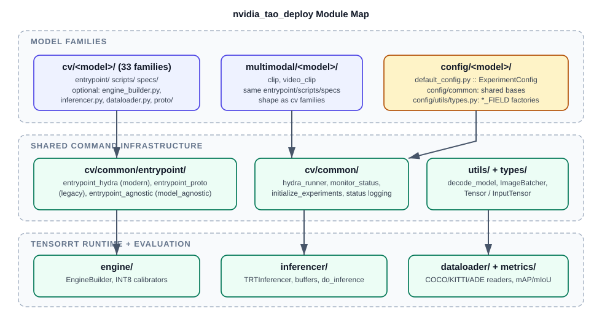

# Codebase Tour

This is a guided walk through the TAO Deploy repository for developers picking
up the codebase for the first time. It answers three questions: what each
directory is for, how the Python package is organized into modules, and where
the sharp edges are.

For what the product is, how customers run it, and definitions of the terms
used below (model family, subtask, `tao_deploy`), read the opening sections of
[Architecture](architecture.md) first; this repository builds the
`nvcr.io/nvidia/tao/tao-toolkit:<version>-deploy` container, and the console
commands below are its user-facing surface.



## Repository Layout

```text
tao-deploy/
├── nvidia_tao_deploy/        # The installable Python package (everything shipped in the wheel)
│   ├── cv/                   # 33 model families + cv/common shared entrypoint infra
│   ├── multimodal/           # clip, video_clip model families
│   ├── config/               # Hydra dataclass schemas, one package per model family
│   ├── engine/               # TensorRT engine building and INT8 calibration
│   ├── inferencer/           # TensorRT execution wrappers (buffers, bindings, infer loop)
│   ├── dataloader/           # Shared dataset readers (COCO, KITTI, ADE20K, COCO-panoptic)
│   ├── metrics/              # COCO mAP, KITTI AP, semantic-segmentation mIoU
│   ├── utils/                # Model decoding (.etlt/.onnx), image batching, path helpers
│   └── types/                # Tensor / InputTensor value objects used by inferencers
├── runner/tao_deploy.py      # Host-side Docker launcher (not shipped in the wheel)
├── scripts/envsetup.sh       # Defines the tao_deploy shell function; installs git hooks
├── docker/                   # Base development image: Dockerfile, manifest.json, requirements
├── release/                  # Release image, version metadata (release/python/version.py)
├── internal/                 # Maintainer-only helpers (proto regeneration, ONNX encrypt/decrypt)
├── tools/                    # update_docs_supported_commands.py (generates supported_commands.md)
├── tests/                    # pytest suites, one directory per covered model family plus tests/core
├── docs/                     # This documentation
├── .github/                  # GitHub Actions workflows and shared hook scripts
├── tao-core/                 # Git submodule: shared TAO config/microservice/telemetry code
├── setup.py                  # Package definition and console_scripts (one per model command)
└── Makefile                  # Wheel build targets (build, build_l4t, install, clean)
```

The rules of thumb are:

* If it ships to users, it lives under `nvidia_tao_deploy/`.
* If it launches or builds containers, it lives in `runner/`, `docker/`, or
  `release/`.
* If it validates the repository, it lives in `tests/`, `.pre-commit-config.yaml`, or
  `.github/workflows/`.

## The Package in One Table

| Module | Role | Key files |
| :--- | :--- | :--- |
| `cv/<model>/` | One deployable model family: entrypoint, subtask scripts, spec templates, and any model-specific builder/inferencer/dataloader. | `entrypoint/<model>.py`, `scripts/*.py`, `specs/*.yaml` |
| `cv/common/` | Shared command infrastructure: the three entrypoint styles, the Hydra runner, status logging, telemetry, and experiment initialization. | `entrypoint/entrypoint_hydra.py`, `entrypoint/entrypoint_proto.py`, `entrypoint/entrypoint_agnostic.py`, `hydra/hydra_runner.py`, `decorators.py`, `initialize_experiments.py` |
| `multimodal/<model>/` | Same shape as `cv/<model>/` for CLIP-style models. | `clip/`, `video_clip/` |
| `config/<model>/` | Structured dataclass schema mirrored from the training side. | `default_config.py` (always defines `ExperimentConfig`) |
| `config/common/` | Shared config bases every model extends. | `common_config.py` (`CommonExperimentConfig`, `GenTrtEngineConfig`, `TrtConfig`, `CalibrationConfig`) |
| `config/utils/` | Typed field factories that attach UI/validation metadata. | `types.py` (`STR_FIELD`, `INT_FIELD`, `DATACLASS_FIELD`, ...) |
| `engine/` | ONNX/UFF parsing, optimization profiles, precision selection, engine serialization, INT8 calibration. | `builder.py` (`EngineBuilder`), `calibrator.py`, `tensorfile_calibrator.py` |
| `inferencer/` | Engine loading, I/O tensor discovery, host/device buffers, the infer loop. | `base_inferencer.py`, `trt_inferencer.py` (`TRTInferencer`), `utils.py` (`allocate_buffers`, `do_inference`) |
| `dataloader/` | Batch iterators that pair preprocessed images with ground truth for evaluation. | `coco.py` (`COCOLoader`), `kitti.py`, `ade.py`, `coco_panoptic.py` |
| `metrics/` | Metric computation for `evaluate` subtasks. | `coco_metric.py`, `kitti_metric.py`, `semantic_segmentation_metric.py` |
| `utils/` | Cross-cutting helpers. | `decoding.py` (`decode_model`), `image_batcher.py` (`ImageBatcher`) |
| `types/` | Typed views over engine bindings. | `tensors.py` (`Tensor`, `InputTensor`) |

## Model Family Inventory

Every family has the same skeleton — `entrypoint/<name>.py`, `scripts/`, and
`specs/` — but the repository contains two generations of command plumbing, and which
one a family uses is the single most important thing to know before editing it.

**Hydra-style (modern: YAML specifications, dataclass schemas under `config/`):**
`centerpose`, `classification_pyt`, `classification_tf2`, `deformable_detr`,
`depth_net`, `dino`, `efficientdet_tf2`, `grounding_dino`, `mae`,
`mask2former`, `mask_grounding_dino`, `ml_recog`, `nvdinov2`, `ocdnet`,
`ocrnet`, `oneformer`, `optical_inspection`, `pointpillars`, `rtdetr`,
`segformer`, `visual_changenet`, plus `multimodal/clip` and
`multimodal/video_clip`.

**Proto-style (legacy: protobuf text specifications, `proto/` package per family):**
`classification_tf1`, `detectnet_v2`, `efficientdet_tf1`, `faster_rcnn`,
`lprnet`, `mask_rcnn`, `multitask_classification`, `retinanet`, `ssd`, `unet`,
`yolo_v3`, `yolo_v4`.

Quick way to tell them apart: a Hydra family has a mirror package under
`nvidia_tao_deploy/config/<name>/`; a proto family has a `proto/` directory with
checked-in `*_pb2.py` files instead (regenerated by hand with
`internal/generate_pb2.sh <name>`).

Naming quirks to expect: `ml_recog` (source directory) is tested under
`tests/metric_learning_recognition/`; `classification_tf1`,
`classification_tf2`, and `classification_pyt` are three unrelated families;
`dssd` and `yolo_v4_tiny` are console-script aliases for `ssd` and `yolo_v4`.

## Anatomy of One Family: `dino`

```text
nvidia_tao_deploy/cv/dino/
├── entrypoint/dino.py            # ~35 lines: argparse shell over entrypoint_hydra
├── scripts/gen_trt_engine.py     # ONNX/ETLT -> .engine
├── scripts/evaluate.py           # engine + COCO dataset -> mAP
├── scripts/inference.py          # engine + image dir -> annotated images + labels
└── specs/{gen_trt_engine,evaluate,infer}.yaml
nvidia_tao_deploy/config/dino/
├── default_config.py             # ExperimentConfig (top-level schema)
└── {dataset,model,train,deploy}.py
```

Notice what is *missing*: DINO has no builder, inferencer, or dataloader of its
own. It reuses `deformable_detr`'s — `DDETRDetEngineBuilder`,
`DDETRInferencer`, and `DDETRCOCOLoader` in
`nvidia_tao_deploy/cv/deformable_detr/`. `rtdetr` reuses the builder and
inferencer the same way. Sharing a sibling family's runtime classes is a
normal, encouraged pattern; check for an existing builder before writing a new
one.

Command flow for `dino gen_trt_engine -e spec.yaml`:

1. The `dino` console script (registered in `setup.py`) calls
   `cv/dino/entrypoint/dino.py:main`.
2. `entrypoint_hydra.get_subtasks()` discovers `scripts/*.py` as subtasks and
   injects the synthetic `default_specs` subtask.
3. `entrypoint_hydra.launch()` converts `-e` into Hydra `--config-path` and
   `--config-name` flags, sets `CUDA_VISIBLE_DEVICES`, and **spawns a fresh
   `python .../scripts/gen_trt_engine.py` subprocess**.
4. Inside the child, `@hydra_runner(..., schema=ExperimentConfig)` validates the
   YAML against the dataclass schema, and `@monitor_status(...)` creates the
   results dir, dumps the resolved configuration, and writes `status.json`.
5. The script body decodes the model (`decode_model`), builds the engine
   (`DDETRDetEngineBuilder.create_network()` then `create_engine()`), and
   serializes the plan to `gen_trt_engine.trt_engine`.

The subprocess step matters for debugging: breakpoints set in a `scripts/*.py`
are never hit when you launch via the console command. Run the script module
directly with `--config-path`/`--config-name` to debug it in-process.

## Where Shared Behavior Lives

| Behavior | Implementation |
| :--- | :--- |
| Subtask discovery, `default_specs` injection | `cv/common/entrypoint/entrypoint_hydra.py::get_subtasks` |
| Spec-file to Hydra flag translation, GPU selection, subprocess launch, telemetry | `cv/common/entrypoint/entrypoint_hydra.py::launch` |
| Legacy argparse dispatch | `cv/common/entrypoint/entrypoint_proto.py::launch_job` |
| `model_agnostic` command (reads `model_name` from the spec) | `cv/common/entrypoint/entrypoint_agnostic.py` |
| Schema registration and Hydra invocation | `cv/common/hydra/hydra_runner.py` |
| Results dir creation, config dump, `status.json`, error classification | `cv/common/decorators.py::monitor_status` |
| Calibration config validation, builder/engine kwarg assembly | `cv/common/initialize_experiments.py::initialize_gen_trt_engine_experiment` |
| Encrypted model decode (`.etlt` vs `.onnx` vs `.uff`) | `utils/decoding.py::decode_model` |

## Sharp Edges

The following behaviors surprise every new developer; they are collected in one place:

* **The `tao-core` submodule is required at import time.**
  `cv/common/logging/status_logging.py` imports from `nvidia_tao_core`
  unguarded, so with an uninitialized submodule essentially every command dies
  on import. Run `git submodule update --init` first; `scripts/envsetup.sh`
  puts `tao-core/` on `PYTHONPATH` for containers.
* **Subtask name and specification template name diverge in roughly 34 scripts across 18 families.** The default
  template is chosen by `hydra_runner(config_name=...)`, not by the script
  filename. Most detection families map `inference.py` to `infer.yaml`;
  `segformer/gen_trt_engine.py` uses `config_name="export"`. Some subtasks
  (`ml_recog gen_trt_engine`, all of `depth_net` and `visual_changenet`) have
  no matching default template and only work with an explicit `-e`. Always read
  the decorator.
* **`workspace_size` units are inconsistent.** `EngineBuilder(workspace=...)`
  takes gigabytes, but several specifications express `tensorrt.workspace_size` in megabytes; hence
  `workspace_size // 1024` conversions inside nine families'
  `gen_trt_engine.py` (centerpose, deformable_detr, dino, grounding_dino,
  mask2former, mask_grounding_dino, ml_recog, oneformer, rtdetr). Check the
  conversion before copying a value.
* **Multi-GPU is intentionally disabled.** `entrypoint_hydra.launch()` parses
  `num_gpus`/`gpu_ids` and then clamps to a single GPU. Do not document or rely
  on multi-GPU behavior.
* **`model_agnostic` only reaches `cv/` families.** It imports
  `nvidia_tao_deploy.cv.<model>.scripts`, so `clip` and `video_clip` cannot be
  driven through it. It reads `model_name` from the raw specification YAML in the parent
  process and raises `KeyError` if the key is absent. None of the shipped
  specification templates include it, so you must add it by hand.
* **UFF paths are effectively dead on current base images.** On TensorRT >= 9
  the UFF branches in `engine/builder.py` raise `NotImplementedError`, so
  legacy families are ONNX/ETLT-ONNX only in practice. There is no TensorFlow
  anywhere in this repo; the TF1- and TF2-era families are TF-*trained* models consumed as
  exported artifacts.
* **Dataclass defaults are not the whole story.** The `*_FIELD` factories in
  `config/utils/types.py` carry both a live `value` (the dataclass default) and
  separate `default_value` metadata used by specification generation and the FTMS UI,
  and the two can differ. When documenting a default, check both.
* **No pytest configuration file exists.** There is no `conftest.py`,
  `pytest.ini`, or `pyproject.toml`, so the per-family markers used in `tests/`
  are unregistered and marker selection (`-m`) works only incidentally. Prefer
  path-based selection: `pytest tests/<family>/`.
* **`specs_output/experiment.yaml`** at the repository root is a committed generated
  artifact from an old release. Nothing references it; do not treat it as a
  template.
